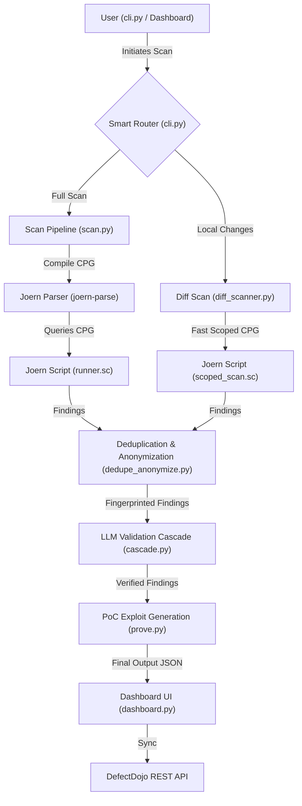
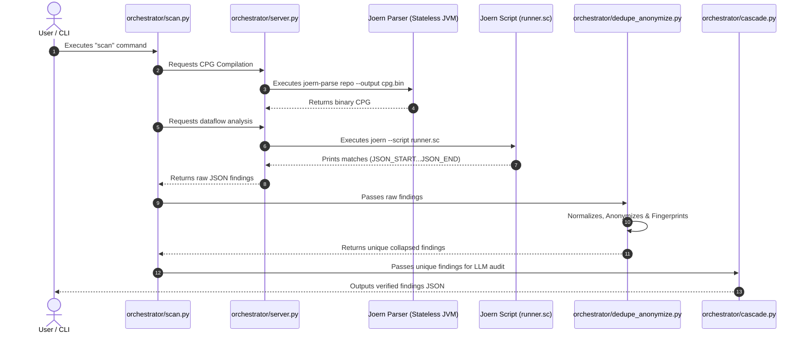
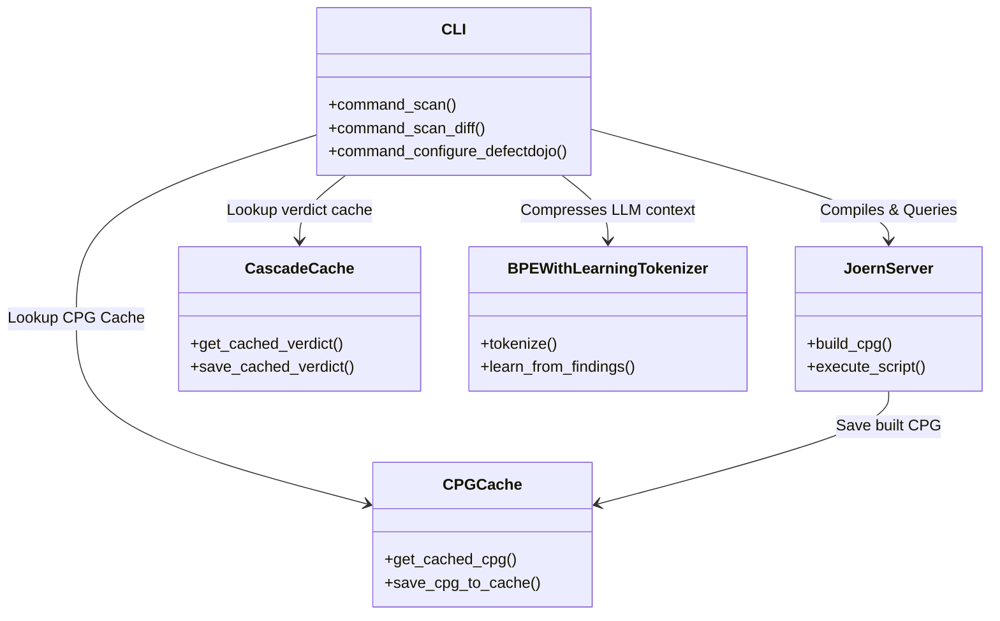
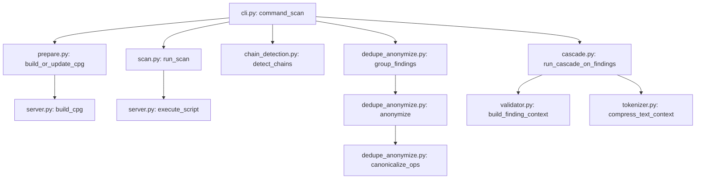

# Taintlace: Complete Project Analysis

This document provides a comprehensive, beginner-friendly explanation of the **Taintlace Multi-Stage Agentic SAST Engine** codebase. It maps every feature, file, and dataflow in simple terms to help you master the codebase, prepare for technical presentations, or explain it confidently in interviews.

---

## 1. Project Overview

### What It Does
Taintlace is an **Agentic Static Application Security Testing (SAST)** engine. It analyzes source code repositories to detect security vulnerabilities (like SQL Injections, Command Injections, SSRF, and XXE) before the code is deployed.

### The Problem It Solves
Traditional SAST tools are notoriously noisy, generating a massive volume of **false positives** (vulnerabilities that aren't actually exploitable). Developers waste hours triaging these false alarms. 
Taintlace solves this by coupling static graph-based taint tracking with **LLM validation agents** (acting as automated security analysts) that independently verify each finding, filter out false positives, and write functional Proof-of-Concept (PoC) exploit payloads for valid issues.

### Architecture Overview
Taintlace works in stages:
1. **Ingestion**: The user passes a local or remote Git repository.
2. **CPG Parsing**: Joern compiles the repository's source code into a Code Property Graph (CPG).
3. **Dataflow Scans**: Scala scripts query the CPG to trace if tainted data (untrusted user input) can propagate to sensitive function parameters (sinks).
4. **Processing**: Results are grouped, anonymized, and structurally fingerprinted.
5. **Cascade Validation**: A tiered LLM state machine verifies the path, escalating difficult cases, filtering false positives, and generating PoCs.
6. **Remediation & Review**: Findings are loaded into an interactive web dashboard (served locally on port `8081`) and can be synced with DefectDojo.

### Technology Stack
* **Language**: Python (Orchestrator CLI and LLM State Machine), Scala/Gremlin (Joern Queries).
* **Static Analysis**: Joern CLI (Stateless JVM compilation and script execution).
* **LLM Engine**: Groq API (using Llama-3/custom LLM configurations).
* **Interface**: Rich console interface (Python CLI) and HTML/JS/CSS (Verification Dashboard).

---

## 2. Folder-by-Folder Explanation

* **`sast-engine/`**: The core directory of the SAST orchestrator.
  * **`sast-engine/config/`**: Contains YAML policy files defining security rules, LLM tiers, severity maps, and remediation SLAs.
  * **`sast-engine/llm/`**: Houses modules that interact with the LLM API, handle prompt templates, redact secrets, parser structures, and manage rate limits.
  * **`sast-engine/orchestrator/`**: Handles the pipeline steps, containing modules for CPG compilation, deduplication, Git parsing, and the verification dashboard.
  * **`sast-engine/queries/`**: Joern scripts written in Scala (`.sc`) that perform the actual graph dataflow taint-tracking logic.
  * **`sast-engine/risk/`**: Integrates severity and remediation timelines based on policies.
* **`dashboard/`**: The frontend static files (HTML, CSS, JS) that render the verification dashboard in the browser.
* **`tests/`**: Unit tests that validate tokenizers, anonymizers, risk policies, and integrated workflows.
* **`scan_history/`**: Generated outputs directory containing the results of previous scan files in JSON format.
* **`cloned_repos/`**: Local cache directory where remote GitHub repositories are cloned and updated.

---

## 3. File-by-File Explanation

### CLI Entrypoint
#### [`cli.py`](file:///c:/Users/thane/OneDrive/Desktop/project/Multi-agentic-sast-engine/cli.py)
* **What it does**: Represents the main Command Line Interface of Taintlace.
* **How it works**: Uses `argparse` to register commands (`scan`, `scan-diff`, `prove`, `dashboard`, `validate`, `configure-defectdojo`). If launched with no arguments, boots into an interactive menu. Handles cloning of GitHub repositories, reads settings from `.env`, and coordinates execution of stages.
* **Dependencies**: Calls [prepare.py](file:///c:/Users/thane/OneDrive/Desktop/project/Multi-agentic-sast-engine/sast-engine/orchestrator/prepare.py), [scan.py](file:///c:/Users/thane/OneDrive/Desktop/project/Multi-agentic-sast-engine/sast-engine/orchestrator/scan.py), [cascade.py](file:///c:/Users/thane/OneDrive/Desktop/project/Multi-agentic-sast-engine/sast-engine/orchestrator/cascade.py), [prove.py](file:///c:/Users/thane/OneDrive/Desktop/project/Multi-agentic-sast-engine/sast-engine/orchestrator/prove.py), and [dashboard.py](file:///c:/Users/thane/OneDrive/Desktop/project/Multi-agentic-sast-engine/sast-engine/orchestrator/dashboard.py).

---

### Orchestrator Component
#### [`sast-engine/orchestrator/prepare.py`](file:///c:/Users/thane/OneDrive/Desktop/project/Multi-agentic-sast-engine/sast-engine/orchestrator/prepare.py)
* **What it does**: Compiles a repository into a CPG binary.
* **How it works**: Computes a cache key based on Git commits. If cached, copies the binary from cache. Otherwise, calls `JoernServer.build_cpg` to generate it.
* **Calls**: [server.py](file:///c:/Users/thane/OneDrive/Desktop/project/Multi-agentic-sast-engine/sast-engine/orchestrator/server.py), [cpg_cache.py](file:///c:/Users/thane/OneDrive/Desktop/project/Multi-agentic-sast-engine/sast-engine/orchestrator/cpg_cache.py).

#### [`sast-engine/orchestrator/server.py`](file:///c:/Users/thane/OneDrive/Desktop/project/Multi-agentic-sast-engine/sast-engine/orchestrator/server.py)
* **What it does**: Executes stateless JVM subprocesses for Joern commands.
* **How it works**: Triggers `joern-parse` to compile the source code directory, and `joern --script` to run analysis queries. Correctly escapes double quotes for Windows shell execution.

#### [`sast-engine/orchestrator/scan.py`](file:///c:/Users/thane/OneDrive/Desktop/project/Multi-agentic-sast-engine/sast-engine/orchestrator/scan.py)
* **What it does**: Coordinates the global query execution scan step.
* **How it works**: Reads rule categories in [sinks_sources.yaml](file:///c:/Users/thane/OneDrive/Desktop/project/Multi-agentic-sast-engine/sast-engine/config/sinks_sources.yaml). For each category, calls `JoernServer.execute_script` running [runner.sc](file:///c:/Users/thane/OneDrive/Desktop/project/Multi-agentic-sast-engine/sast-engine/queries/runner.sc) and parses findings.

#### [`sast-engine/orchestrator/diff_scanner.py`](file:///c:/Users/thane/OneDrive/Desktop/project/Multi-agentic-sast-engine/sast-engine/orchestrator/diff_scanner.py)
* **What it does**: Coordinates lightweight local diff-scoped scans.
* **How it works**: Identifies changed lines, builds an isolated CPG for *only* the modified files, and runs [scoped_scan.sc](file:///c:/Users/thane/OneDrive/Desktop/project/Multi-agentic-sast-engine/sast-engine/queries/scoped_scan.sc) restricted to those line intersections.

#### [`sast-engine/orchestrator/impact_analyzer.py`](file:///c:/Users/thane/OneDrive/Desktop/project/Multi-agentic-sast-engine/sast-engine/orchestrator/impact_analyzer.py)
* **What it does**: Determines if local file changes have structural ripple effects.
* **How it works**: Scans diff hunk lines. If function signatures, imports, sanitizers, or global package files are changed, rejects incremental scanning and enforces a `FULL_SCAN`.

#### [`sast-engine/orchestrator/diff.py`](file:///c:/Users/thane/OneDrive/Desktop/project/Multi-agentic-sast-engine/sast-engine/orchestrator/diff.py)
* **What it does**: Extracts modified line numbers from Git.
* **How it works**: Parses `git diff HEAD -U0` to build a map of modified lines per file. Includes untracked files if they are under a 400-line threshold.

#### [`sast-engine/orchestrator/chain_detection.py`](file:///c:/Users/thane/OneDrive/Desktop/project/Multi-agentic-sast-engine/sast-engine/orchestrator/chain_detection.py)
* **What it does**: Links separate vulnerabilities together.
* **How it works**: Checks if a finding's sink node matches the source node of another finding (e.g. SSRF sink $\rightarrow$ Deserialization source). Assigns a UUID and sets `severity_boost=True`.

#### [`sast-engine/orchestrator/dedupe_anonymize.py`](file:///c:/Users/thane/OneDrive/Desktop/project/Multi-agentic-sast-engine/sast-engine/orchestrator/dedupe_anonymize.py)
* **What it does**: Normalizes, anonymizes, and groups findings.
* **How it works**: 
  1. Lexes tokens using a balanced bracket tracking scanner (`tokenize_balanced`).
  2. Swaps commutative expressions alphabetically (`canonicalize_ops`).
  3. Replaces local variables with `<VAR_N>` placeholders while preserving whitelisted language terms.
  4. Fingerprints matching paths and collapses duplicates into instances.
  5. Performs secondary location deduplication (`dedupe_by_location`).

#### [`sast-engine/orchestrator/cascade.py`](file:///c:/Users/thane/OneDrive/Desktop/project/Multi-agentic-sast-engine/sast-engine/orchestrator/cascade.py)
* **What it does**: The LLM validation state machine.
* **How it works**: Auto-verifies identical lines (Tier 1). Queries cascade cache. Truncates context, compresses text using custom BPE tokens, and invokes Tier 2 (Fast LLM). Overrides false positives using a deterministic check, and escalates to Tier 3 (Deep LLM) or Tier 4 (Human Queue).

#### [`sast-engine/orchestrator/prove.py`](file:///c:/Users/thane/OneDrive/Desktop/project/Multi-agentic-sast-engine/sast-engine/orchestrator/prove.py)
* **What it does**: Generates PoC exploit payloads for valid issues.
* **How it works**: Queries deep LLMs with exploit prompts, storing generated payloads under `generated_poc`.

#### [`sast-engine/orchestrator/dashboard.py`](file:///c:/Users/thane/OneDrive/Desktop/project/Multi-agentic-sast-engine/sast-engine/orchestrator/dashboard.py)
* **What it does**: Embeds a verification server.
* **How it works**: Spawns an HTTP server on port `8081` serving dashboard APIs for approval status changes and DefectDojo synchronization.

---

### LLM Component
#### [`sast-engine/llm/tokenizer.py`](file:///c:/Users/thane/OneDrive/Desktop/project/Multi-agentic-sast-engine/sast-engine/llm/tokenizer.py)
* **What it does**: Normalizes finding text and learns recurring vocabulary patterns.
* **How it works**: Formats findings, converts characters to bytes, matches greedy vocabulary chains, and tracks frequency counts. Promotes phrases seen $\geq 10$ times to a vocabulary file, replacing them in prompts with token headers to save tokens.

#### [`sast-engine/llm/validator.py`](file:///c:/Users/thane/OneDrive/Desktop/project/Multi-agentic-sast-engine/sast-engine/llm/validator.py)
* **What it does**: Reconstructs source-code context.
* **How it works**: Uses a brace parser to extract entire method bodies containing dataflow nodes. If over-budget, falls back to line-level snippets.

---

## 4. Complete Feature Mapping

### Commutative Operator Normalization
* **What it does**: Swaps expressions like `y == x` to `x == y` so they produce identical fingerprints.
* **Execution Flow**: `dedupe_anonymize.py` $\rightarrow$ `tokenize_balanced` (lexes brackets) $\rightarrow$ `canonicalize_ops` (sorts variables surrounding operators) $\rightarrow$ `anonymize` $\rightarrow$ unique SHA-256 fingerprint.

### Context BPE Token Compression
* **What it does**: Learns frequent code patterns and replaces them with a short token name in the LLM prompt.
* **Execution Flow**: `cascade.py` $\rightarrow$ `tokenizer.py` $\rightarrow$ `learn_from_findings` (counts occurrences) $\rightarrow$ `compress_text_context` (replaces matched strings, prepends token definitions header).

### DefectDojo Syncing
* **What it does**: Pushes approved findings to the DefectDojo REST API.
* **Execution Flow**: User clicks push in browser dashboard $\rightarrow$ `dashboard.py` parses URL, Token, and Engagement ID (using environment defaults) $\rightarrow$ Sends HTTP POST to `/api/v2/findings/`.

---

## 5. Complete Request Flow

The following sequence diagram outlines the data flow when a user requests a scan:

---

## 6. Complete Joern Analysis

### Why Joern is Used
Traditional tools only match text strings. They do not know how variables are passed around or modified. Joern compiles code into a **Code Property Graph (CPG)**, which connects the code's syntax tree, execution statements, and data dependencies in a single database graph. Taintlace queries this graph to verify if data flows from sources to sinks.

### CPG Core Concepts
1. **Abstract Syntax Tree (AST)**: Matches code structure.
2. **Control Flow Graph (CFG)**: Matches execution sequence.
3. **Data Dependence Graph (DDG)**: Traces variables assignment propagation.

### Compilation and Queries Process
1. **Generation**: `prepare.py` builds the CPG:
   `joern-parse.bat "path/to/repo" --output "path/to/cpg.bin"`
2. **Import**: The script [runner.sc](file:///c:/Users/thane/OneDrive/Desktop/project/Multi-agentic-sast-engine/sast-engine/queries/runner.sc) imports the CPG:
   `importCpg(cpg_path)`
3. **Taint Traversal**: Resolves source and sink nodes based on regex patterns:
   `val flows = sinkNodes.reachableByFlows(sourceNodes)`
4. **Execution**: Done in `server.py` via subprocess:
   `joern.bat --script runner.sc --param "cpg_path=cpg.bin" --param "sources=..." --param "sinks=..."`
5. **Output**: Scripts print matched paths:
   `JSON_START:{"category": "injection", ...}:JSON_END`
6. **Parsing**: `scan.py` searches stdout for `JSON_START:` boundaries to parse findings.
7. **Clean up**: Temporary file hashes and CPGs are automatically deleted in `finally` blocks.

---

## 7. Why Joern Was Chosen

* **Cross-File Dataflow**: Connects method definitions across different files, matching imports.
* **Precedence and Scopes**: Understands language variable scoping and block nesting.
* **High Extensibility**: Uses Gremlin/Scala scripting, enabling users to write custom queries easily.

---

## 8. Why This Project Uses Joern Instead of Semgrep

* **Semgrep is NOT used in this project.**
* **Differences**: Semgrep is a pattern-matching scanner that operates on Abstract Syntax Trees (ASTs). It scans file-by-file and is highly effective at finding simple patterns (e.g. matching `eval(req.query)` within a single block). However, it does not trace deep, inter-file data dependencies.
* **Why Joern is better here**: Joern builds a graph representation (CPG) linking CFG and DDG across all files. Taintlace needs to trace untrusted inputs through complex helper functions and classes across the entire codebase—a requirement Semgrep cannot satisfy.

---

## 9. Database Analysis

Taintlace **does not use a database engine** (like PostgreSQL or SQLite). It uses **file-system JSON storage and caching**:
* **CPG Cache**: `.taintlace/cpg_cache/` maps Git commits to compiled `.bin` graphs.
* **Cascade Cache**: `.taintlace/cascade_cache/` maps finding fingerprints to LLM validation JSON logs.
* **Dynamic Vocab Cache**: `.state/tokenizer_learned_vocabulary.json` stores dynamic BPE mappings.
* **Scan History**: `./scan_history/` preserves final results as JSON outputs.

---

## 10. API Documentation

Served locally by [dashboard.py](file:///c:/Users/thane/OneDrive/Desktop/project/Multi-agentic-sast-engine/sast-engine/orchestrator/dashboard.py) on port `8081`:

### 1. Get Scan Data
* **URL**: `/api/data`
* **Method**: `GET`
* **Response**: JSON array of findings with paths, severity, PoCs, and verdicts.

### 2. Get DefectDojo Config
* **URL**: `/api/defectdojo_config`
* **Method**: `GET`
* **Response**: Config details (URL, Engagement ID, Token status).

### 3. Approve Finding
* **URL**: `/api/approve`
* **Method**: `POST`
* **Request**: `{"fingerprint": "...", "state": "APPROVED | REJECTED"}`
* **Response**: `{"success": true}`

### 4. Push to DefectDojo
* **URL**: `/api/push_defectdojo`
* **Method**: `POST`
* **Request**: `{"fingerprint": "..."}` (optional, uploads all approved if empty).
* **Response**: `{"success": true, "pushed": 1, "errors": []}`

---

## 11. Class Dependency Mapping

The class structure of Taintlace components is outlined below:

---

## 12. Function Call Graph

The major function calls triggered during a scan execution:

---

## 13. Configuration Files

* **`.env`**: Stores the environment variables (e.g. `GROQ_API_KEY`, `DEFECTDOJO_URL`, `DEFECTDOJO_API_KEY`).
* **`sinks_sources.yaml`**: Standardizes regex patterns for sources, sinks, and sanitizers across Python, Java, JS/TS, and PHP.
* **`cascade_config.yaml`**: Configures LLM tiers, model names, temperature, requests per minute limits, and API request budgets.
* **`priority_policy.yaml`**: Defines mappings between vulnerability severity levels and remediation priorities (P1–P4).
* **`sla_policy.yaml`**: Sets remediation SLA limits (in days) and lists escalation matrix notifications.

---

## 14. Error Handling

* **Validation Checks**: Input filenames are sanitized to prevent directory traversal attacks (checks for `..`, `/`, `\`).
* **LLM API Fallbacks**: If the API throws a rate limit (HTTP 429) or connection timeout, request invocations perform exponential backoff retries. If JSON formatting fails validation, the retry prompt requests a formatted correction.
* **Stateless Recovery**: If a scoped diff scan fails, the CLI catches the exception and falls back to running a full scan automatically.

---

## 15. Security

* **Keyring Storage**: Secure credentials (like API Tokens) are stored in the platform's keyring instead of plaintext variables where possible.
* **Safe Command Execution**: Commands parsed in `server.py` use double quotes to prevent argument injection attacks.
* **Secrets Redaction**: `cascade.py` calls `redact_secrets` on context code snippets to ensure no passwords, API keys, or private tokens are sent to external LLMs.

---

## 16. Complete End-to-End Example

1. The user executes: `taintlace scan --repo ./demo-repo --output findings.json`
2. **Smart Router**: Detects git, checks files, and decides on a full scan.
3. **Prepare**: Calls `build_or_update_cpg`. If commit hash is cached, loads `./.taintlace/cpg_cache/demo-repo/head.bin`.
4. **Scan**: Calls `run_scan`. Joern parses the graph and runs queries:
   * Reaches sink `db.execute(user_input)` from source `req.getQueryString()`.
5. **Deduplication**: Resolves names (e.g. `user_id == req.input`) to `<VAR_1> == req.input` via `canonicalize_ops` and `anonymize`. Collapses matching traces.
6. **LLM Validation**: `build_finding_context` extracts method scopes. BPE replaces repeating code chunks with tokens. Fast LLM (Tier 2) validates. If verified, sets verdict to `VALID`.
7. **Exploit Prove**: Runs `prove.py` generating curl exploit payloads.
8. **Export**: Saves final findings metadata array into `findings.json`.

---

## 17. Interview Preparation

### "How to Explain This Project to an Interview Panel"

#### 2-Minute Explanation (Elevator Pitch)
"I built Taintlace, a multi-stage agentic SAST engine designed to eliminate false positives in static application security testing. It uses Joern to parse source code into a Code Property Graph, tracing data flows from inputs (sources) to sensitive execution points (sinks) across Python, Java, JavaScript, and PHP. Once static matches are found, the engine runs them through a tiered LLM validation cascade that acts as an automated security analyst. It checks code context, filters out false alarms, and generates functional Proof-of-Concept exploits for verified vulnerabilities, automatically prioritizing them against service SLA policies."

#### 5-Minute Explanation
"Taintlace is designed to bridge the gap between static analysis and human triage. 
Traditional SAST is highly configuration-dependent and generates massive false positives because it cannot reason about application logic. Taintlace handles this by executing in three main phases:
First, it compiles the target codebase into a graph database representation called a Code Property Graph (CPG) using Joern. We run Gremlin/Scala dataflow queries to check if untrusted variables propagate to sinks like database queries or system shells.
Second, we perform AST tokenization and anonymization to deduplicate duplicate paths, creating structural fingerprints.
Third, we feed the code context to a cascade validation model. We built a custom BPE tokenizer that learns frequent code structures and compresses them to save LLM tokens. The LLM acts as an auditor: verifying if inputs are truly attacker-controlled, checking if sanitizers are active, and validating exploitability. If verified, a deep LLM agent generates a cURL exploit payload. Finally, findings are served in an interactive verification dashboard for push synchronization to DefectDojo."

#### 10-Minute Technical Explanation
* **Introduction**: Discuss the architectural problem (false positives in AppSec) and why standard pattern matching falls short.
* **Phase 1: Smart Routing & Git Parsing**: Explain `diff.py` and `impact_analyzer.py` checking if local changes are isolated (`SAFE_LOCAL`) or require a full compile (`FULL_SCAN`), saving build resources.
* **Phase 2: Graph Analysis (Joern)**: Explain how Joern compiles code into AST, CFG, and DDG. Discuss the Gremlin queries in `runner.sc` calling `reachableByFlows` and traversing nodes cross-file.
* **Phase 3: Structural Deduplication**: Discuss `dedupe_anonymize.py`. Explain how `tokenize_balanced` implements a bracket-tracking lexer to correctly handle nested parameters and function calls, and how `canonicalize_ops` sorts variables alphabetically to group identical structures.
* **Phase 4: LLM Validation Cascade**: Explain the state machine in `cascade.py`. Detail the token budget restriction (6,000 tokens), the BPE dynamic learning algorithm in `tokenizer.py` (which promotes phrases appearing $\geq 10$ times), and the deterministic gate that overrides LLM false positive errors if dataflow traces remain unsanitized.
* **Phase 5: Exploit Verification & Risk Policies**: Explain how `prove.py` writes curl scripts using exploit templates, and how `priority_policy.py` maps severities to remediation deadlines.
* **Conclusion**: Discuss the Embedded verification server (`dashboard.py`) and DefectDojo integration.

#### Common Interview Questions & Answers

* **Q: Why does the engine compile a Code Property Graph instead of just parsing code files?**
  * **A**: Files are just text. A CPG connects variables to their execution branches (CFG) and assignment chains (DDG) across files. This is the only way to track if a variable passed in a controller file propagates to a database executor in a database handler class file.
* **Q: Why did you build a custom BPE tokenizer instead of using the standard OpenAI tokenizer?**
  * **A**: Security prompts are code-heavy, which consumes massive token budgets due to boilerplate structures. Our BPE tokenizer dynamically learns repeated code fragments across the codebase, compresses them into brief tokens, and defines them once in the prompt header. This cuts token consumption significantly.
* **Q: How does the engine handle LLM hallucination?**
  * **A**: We enforce strict schema formatting via JSON schema validation APIs. Additionally, we run a deterministic gate in `cascade.py` that checks the LLM's output. If the LLM returns `FALSE_POSITIVE` but the dataflow contains string interpolation and lacks sanitizers, the gate overrides the verdict to `NEEDS_REVIEW`.

---

## 18. Missing Information & Assumptions

* **Joern Version**: The version of Joern installed on the system is assumed to be compatible with standard semantic dataflow queries (`io.joern.dataflowengineoss`). If compatibility issues arise, queries are designed to log JVM compilation errors and fall back cleanly.
* **LLM Gateway API**: The model name `openai/gpt-oss-120b` is assumed to map to a valid endpoint configured behind the Groq API gateway.
