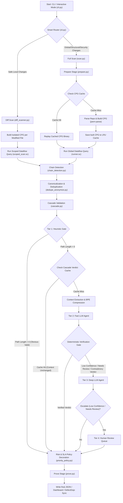

# Taintlace: Multi-Stage Agentic SAST Engine Workflow

Taintlace is a state-of-the-art **Multi-Stage Agentic Static Application Security Testing (SAST)** engine. It combines the rigorous depth of graph-based static analysis (via Code Property Graphs) with the reasoning capabilities of LLM security agents to perform high-fidelity, zero-false-positive vulnerability scans.

This document details the overall workflow, execution strategies, and inner workings of every stage in the pipeline.

---

## Overall Workflow Diagram

The following diagram illustrates how a code repository progresses through Taintlace, showing the decision paths for incremental diff scans vs. full scans, caching, chain analysis, cascade LLM validation, and exploit proof generation:

---

## Stage-by-Stage Breakdown

### 1. Entry Point & CLI Configuration (`cli.py`)
Taintlace exposes a command-line interface that supports both an **Interactive Mode** (console menu using `rich`) and automated **CI/CD Command Flags**.
* **DefectDojo Env Integration**: Loads DefectDojo credentials from environment variables (`DEFECTDOJO_URL`, `DEFECTDOJO_API_KEY`, `DEFECTDOJO_ENGAGEMENT_ID`), falling back to the system keyring. The configuration utility prompts strictly for the API Token, defaulting the server URL to `http://localhost:8080` and the Engagement ID to `1`.
* **Smart Routing**: When running a scan, the CLI uses the smart router to automatically determine if a fast, local-scope diff scan is sufficient, or if a full-graph rebuild is required.

---

### 2. Smart Routing & Impact Analysis (`impact_analyzer.py` & `diff.py`)
Before initiating static analysis, the engine inspects the repository changes using `git diff HEAD -U3` and untracked file listings:
* **Global Files Verification**: If global dependency configurations (e.g. `package.json`, `pom.xml`, `requirements.txt`) are modified, a `FULL_SCAN` is triggered to account for dependency structural changes.
* **Security Boundaries Verification**: Modifying paths containing keywords like `auth`, `security`, `login`, `middleware`, or config changes in `sinks_sources.yaml` forces a `FULL_SCAN`.
* **Contract/Signature Checking**: Touch-points that modify method definitions, exports, imports (`def`, `function`, `class`, `export`, `import`) trigger a `FULL_SCAN` due to potential inter-file dependency updates.
* **Sink/Source/Sanitizer modifications**: Touch-points containing data handling keywords (`exec`, `eval`, `query`, `sql`, `sanitize`, `escape`) trigger a `FULL_SCAN` to maintain security coverage.
* **Incremental Path (`SAFE_LOCAL`)**: If the modifications are restricted to local helper code, the engine routes to `command_scan_diff`.

---

### 3. Stage 1: Prepare - Code Property Graph (CPG) Construction (`prepare.py` & `server.py`)
Taintlace leverages **Joern**, a graph-based code analysis tool, to build a Code Property Graph (CPG) from source code:
* **JVM Stateless Mode**: `JoernServer` runs command invocations of `joern-parse` (to build CPG binaries) and `joern --script` in a stateless JVM wrapper.
* **LRU CPG Cache (`cpg_cache.py`)**: 
  * Computes a cache key based on the Git commit hash. If the working tree is dirty, a SHA-256 hash of the current working-tree diff is appended (`HEAD_diffhash`).
  * If the repository is not a Git repo, it falls back to hashing the file tree recursively (`hash_tree`).
  * Caches are stored in `.taintlace/cpg_cache/`. An Least Recently Used (LRU) eviction algorithm automatically discards older cache binaries when the cache size exceeds `max_entries` (default 5).

---

### 4. Stage 2: Scan - Static Analysis Taint Tracking (`scan.py` & `diff_scanner.py`)
This stage executes dataflow queries inside Joern to identify source-to-sink taint propagation based on definitions in `config/sinks_sources.yaml`.

* **Full Scan (`queries/runner.sc`)**:
  * Loads sources (e.g., HTTP request inputs, parameters, annotations), sinks (e.g. SQL execution methods, shell execution commands), and sanitizers regexes.
  * Queries Joern CPG: `sinkNodes.reachableByFlows(sourceNodes)`.
  * Filters out dataflow paths that pass through registered sanitizers, caps search depth (max 30 hops), and extracts the precise line numbers, code strings, and filenames for all intermediate nodes.
* **Diff Scan (`queries/scoped_scan.sc`)**:
  * Builds a fast, isolated CPG containing *only* the modified files.
  * Extracted lines from `diff.py` are sent to the Scala script as a `changed_lines` filter.
  * The query trace filters out any dataflows that do not intersect with the changed lines, ensuring scans finish in seconds.

---

### 5. Stage 3: Chain Detection (`chain_detection.py`)
Some vulnerabilities are minor in isolation but catastrophic when combined (e.g., Server-Side Request Forgery leading to Deserialization).
* **Correlation Matching**: Taintlace correlates findings where the **sink node ID** of Finding A matches the **source node ID** of Finding B.
* **Dangerous Chains Mapping**: Matches against known vulnerability combinations:
  * `ssrf` $\rightarrow$ `deserialization`
  * `file_read` $\rightarrow$ `deserialization`
* **Boost Action**: If a chain is detected, both findings are assigned a matching `chain_id` UUID and flagged for a `severity_boost`, elevating their urgency.

---

### 6. Stage 4: Deduplication & Anonymization (`dedupe_anonymize.py`)
Raw static analysis findings often contain duplicates due to loop unrolling, duplicate code paths, or variable name variations. Taintlace cleans and deduplicates these findings structurally:
1. **Commutative Canonicalization**: Lexes code statements into balanced tokens at nesting depth 0, tracking nested parentheses/brackets. Identifies commutative operators (such as JS `===`, logical `&&`, `||`, etc.) and sorts their surrounding complex expressions (like property chains or function calls) alphabetically. This preserves correct programming syntax and semantic safety.
2. **Sequential Anonymization**: Parsers inspect code tokens along the dataflow path. Whitelisted language keywords, core types, and globals (e.g., Python built-ins, JS global objects, Java collections, PHP `_GET` arrays) are preserved along with config keywords, while local variables, attributes, parameters, and functions are replaced by sequential placeholders (`<VAR_1>`, `<FUNC_1>`, `<ATTR_1>`).
3. **Structural Fingerprinting**: Computes a SHA-256 fingerprint hash of the vulnerability category, subtype, source file, sink file, and the anonymized code path. Findings sharing the same fingerprint are collapsed into a single finding under an `instances` array.
4. **Secondary Location Deduplication**: Collapses findings sharing the exact same (category, subtype, source_file:line, sink_file:line). It resolves duplicates by keeping the candidate with the highest verdict priority (`VALID` > `NEEDS_REVIEW` > `FALSE_POSITIVE`) and the highest confidence score, merging instance locations, and retaining generated exploit payloads.

---

### 7. Stage 5: Cascade LLM Validation (`cascade.py`, `validator.py`, & `tokenizer.py`)
Static analysis suffers from false positives due to complex branching or unmodeled sanitizers. Taintlace executes a multi-agent LLM cascade validation:

#### Tier 1: Heuristic Gate
Taintlace checks for immediate, obvious cases. For example, if the source and sink lines of a finding are identical (zero path hops), the finding is auto-resolved as `VALID` with `1.0` confidence without sending any LLM requests.

#### Verdict Cache Lookup (`cascade_cache.py`)
Uses the structural fingerprint and context hash to query `.taintlace/cascade_cache/`. If a match is found and is within the 30-day freshness limit, the LLM evaluation is bypassed.

#### Context Extraction & Truncation
`validator.py` reconstructs the source-code context of the dataflow path.
* **Method Boundary Extraction**: Rather than taking fixed-line windows, a brace parser scans the AST upwards to find method declarations and annotations, extracting the full method body containing the target node.
* **Budget Truncation**: If the extracted context exceeds the model's token limit (6,000 tokens), it scales down dynamically:
  1. Truncates full methods to line-level snippets (context lines = 3).
  2. Truncates to critical nodes only (source and sink, discarding intermediate hops).

#### Context Compression (BPE with Learning Tokenizer)
* Standard BPE tokenization is extended with a **dynamic vocabulary learning system**.
* During scans, candidate phrases (code lines, SQL expressions, word n-grams) are tracked. Patterns occurring $\geq 10$ times across findings are promoted to a learned vocabulary state (`.state/tokenizer_learned_vocabulary.json`) and assigned unique pattern tokens (e.g. `[PAT_PATTERN_001]`).
* prompt context is compressed by replacing matching learned patterns with their token representations.
* Critical security keywords (e.g., `select`, `escape`, `sanitize`, `exec`, `eval`) are **explicitly whitelisted** to remain uncompressed so the LLM retains clear view of security logic.
* Mapping definitions are prepended to the prompt as a dictionary header (e.g., `[PAT_PATTERN_001] = db.executeQuery(query)`) so the model can resolve abbreviations. This drastically reduces input token consumption.

#### Tiers 2 & 3: Fast and Deep LLM Agents
* **Tier 2 (Fast Agent)**: Evaluates the finding using `openai/gpt-oss-120b` (fast configuration, low temperature).
* **Deterministic Verdict Verification Gate**: Intercepts the Tier 2 response. If the agent returns `FALSE_POSITIVE` but the code path contains no sanitizers, includes unsafe string concatenation/interpolation, or contains contradictory text (e.g., reasoning text mentions "tainted data reaches the sink"), the verdict is overridden to `NEEDS_REVIEW` and escalated.
* **Tier 3 (Deep Agent)**: Escalates findings to a deep LLM agent if Tier 2 returned low confidence ($< 0.70$) or a `NEEDS_REVIEW` verdict.
* **Tier 4 (Human Review Queue)**: If Tier 3 returns low confidence ($< 0.60$) or a `NEEDS_REVIEW` verdict, it is routed to a manual human triage queue.

---

### 8. Stage 6: Prove - Exploit Proof Generation (`prove.py`)
For all findings flagged as `VALID` or `NEEDS_REVIEW`, the engine fires up the Prove Stage:
* **Exploit LLM Agent**: Employs deep LLMs with specialized instructions (`POC_SYSTEM_PROMPT`) to construct actionable, harmless test exploits demonstrating vulnerability feasibility.
* **PoC Outputs**: Generates curl commands, raw HTTP requests, or input strings and stores them inside `generated_poc` (defaulting to a `NOT_EXECUTED` verification status).

---

### 9. Stage 7: Risk & Priority Policies (`priority_policy.py`)
Remediation times are governed by standardized risk priority mappings:
* **Severity Mapping**: Automatically determines severity (`Critical`, `High`, `Medium`, `Low`) using category and CWE numbers. (e.g. Command Injection & Deserialization are auto-marked `Critical`).
* **Priority Mapping (`config/priority_policy.yaml`)**: Maps severities to priorities:
  * Critical $\rightarrow$ **P1**
  * High $\rightarrow$ **P2**
  * Medium $\rightarrow$ **P3**
  * Low $\rightarrow$ **P4**
* **SLA Policies (`config/sla_policy.yaml`)**: Defines maximum remediation deadlines (P1 = 1 day, P2 = 3 days, P3 = 14 days, P4 = 30 days) and escalation matrices (e.g., if a P1 remains open after 12 hours, notify Security Lead; after 24 hours, escalate to Engineering Manager).

---

### 10. Stage 8: Visualization & Dashboards (`dashboard.py` & `server.py`)
Finally, the results are visualized:
* **Web UI Dashboard**: Renders interactive web UI on port `8081` (defaulting to avoid clashes with DefectDojo on `8080`) displaying findings, severity metrics, dataflow paths, token compression ratios, and exploit PoCs.
* **DefectDojo Sync**: Connects to the central DefectDojo vulnerability management platform utilizing environment settings (`DEFECTDOJO_URL`, `DEFECTDOJO_API_KEY`, `DEFECTDOJO_ENGAGEMENT_ID`) to log findings, track SLAs, and trigger remediation notifications.
