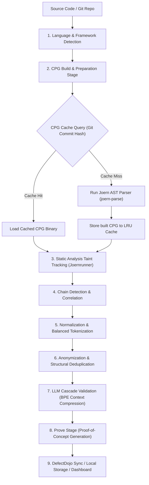

# Taintlace SAST Engine: Technical Workflow & Architecture Analysis

This document provides a comprehensive technical breakdown of the Taintlace Multi-Stage Agentic SAST engine's architectural pipeline. It details the internal mechanics of language detection, CPG building, caching structures, tokenization, anonymization, and normalization strategies.

---

## 1. Core Architecture Pipeline



---

## 2. Language and Framework Detection

The language and framework detection stage identifies the codebase's tech stack to route it to the appropriate semantic analyzer:

* **AST Parser Routing:** Taintlace utilizes **Joern** (`joern-parse`) for graph construction. Joern automatically inspects the target directory to determine the programming language and structure:
  - **File Extension Scanner:** It scans for language-specific extensions:
    - `.py` $\rightarrow$ Routes to `pysrc2cpg` (Python AST Generator)
    - `.js`, `.ts`, `.jsx`, `.tsx` $\rightarrow$ Routes to `jssrc2cpg` (JavaScript/TypeScript AST Generator)
    - `.java`, `.class`, `.jar` $\rightarrow$ Routes to `javasrc2cpg` (Java AST Generator)
    - `.php` $\rightarrow$ Routes to `php2cpg` (PHP AST Generator)
    - `.c`, `.cpp`, `.h` $\rightarrow$ Routes to `c2cpg` (C/C++ AST Generator)
    - `.go` $\rightarrow$ Routes to `go2cpg` (Go AST Generator)
  - **Project Manifest Detection:** Framework boundaries are resolved by looking for configuration files:
    - Node.js/JavaScript frameworks: `package.json`
    - Java/JVM frameworks: `pom.xml` (Maven) or `build.gradle` (Gradle)
    - Python applications: `requirements.txt`, `setup.py`, or `Pipfile`
    - PHP environments: `composer.json`
* **Parser Action:** Joern invokes the relevant language frontend, converting ASTs, Control Flow Graphs (CFG), and Method Call Graphs into a single unified **Code Property Graph (CPG)** binary.

---

## 3. Code Property Graph (CPG) Cache Architecture

CPG parsing can be computationally expensive. Taintlace implements a high-performance **LRU (Least Recently Used) CPG Cache** (`cpg_cache.py`) to bypass graph construction for unchanged repositories:

* **Cache Key Computation Strategy:**
  1. **Clean Git State:** If the repository contains a `.git` folder, Taintlace checks the current HEAD commit hash:
     ```bash
     git rev-parse HEAD
     ```
  2. **Dirty Git State:** If local files have uncommitted changes, Taintlace executes a dirty check (`git status --porcelain`). If changes exist, it runs a diff on HEAD, hashes the diff, and appends it to the commit hash:
     ```python
     diff = git_diff_HEAD()
     diff_hash = sha256(diff)[:8]
     cache_key = f"{head}_{diff_hash}"
     ```
  3. **Non-Git State Fallback (`hash_tree`):** If Git is not present, the engine recursively walks the file tree, skipping common directories (`.git`, `node_modules`, `vendor`, `.venv`, `__pycache__`), and generates a SHA-256 hash based on directory files and their contents.
* **Cache Storage:**
  CPGs are stored in `.taintlace/cpg_cache/<repo_name>/` as two separate files:
  - `<cache_key>.bin`: The built CPG graph database binary.
  - `<cache_key>.meta.json`: JSON metadata containing absolute path, timestamps, cache key, and joern version details.
* **LRU Eviction Policy:**
  To limit disk storage, the cache is restricted to `max_entries` (default 5). When saving a new CPG:
  1. The cache directory is queried for all `.bin` files.
  2. If the count exceeds `max_entries`, the files are sorted by their modification time (`mtime`).
  3. The oldest entries (both `.bin` and `.meta.json`) are permanently deleted.

---

## 4. Normalization Pipeline

To avoid reporting duplicate vulnerabilities due to cosmetic variations, Taintlace passes every dataflow node through a multi-layered normalization pipeline:

### A. Whitespace and Tab Collapsing
Trivial formatting differences (e.g. spaces, tabs, mixed line endings `\r\n` vs `\n`, or non-breaking spaces `\xa0`) are normalized:
```python
t = re.sub(r'[\s\xa0]+', ' ', t).strip()
```

### B. Unicode NFC Composition
To prevent accent/diacritic variations from altering string signatures, all text is normalized to **Normalization Form Canonical Composition (NFC)**:
```python
import unicodedata
t = unicodedata.normalize('NFC', str(t))
```
This merges decomposed characters (e.g., `e` + acute accent `◌́`) into single composed representations (e.g., `é`).

### C. Commutative Operator Canonicalization
Many operators in programming are commutative (e.g. `x == y` is equivalent to `y == x`). Taintlace tokenizes statements at depth 0, identifies commutative operators (`+`, `*`, `==`, `!=`, `===`, `!==`, `&&`, `||`, `&`, `|`, `^`), and lexicographically sorts their left and right operands:
```text
Raw:     user_id == req.input
Lexed:   Left = "user_id" | Op = "==" | Right = "input" ("user_id" > "input")
Result:  req.input == user_id
```

---

## 5. Tokenization Analysis

Tokenization in Taintlace is split into two primary components: **Syntax-Balanced Lexical Tokenization** (used for code structural anonymization) and **BPE Context Compression** (used for prompt token budgeting).

### A. Syntax-Balanced Lexical Tokenization (`tokenize_balanced`)
Taintlace implements a custom lexical parser (`tokenize_balanced`) to split code snippets into structured chunks while respecting syntactical nesting. 

Unlike standard regex splitting, it handles balanced brackets dynamically:
1. **Whitespace & String Literals:** Whitespace and quoted strings (`"..."`, `'...'`) are parsed as standalone tokens (`'space'`, `'string'`).
2. **Balanced Bracket Tracking:** When encountering an opening bracket (`(`, `[`, `{`), the parser records it on a stack. It continues scanning characters until the stack is empty (representing matching closing brackets `)`, `]`, `}` at depth 0). The entire block is wrapped into a single `'bracketed'` token:
   ```text
   Raw Statement:  foo(bar[x + 1]) + baz
   Tokens:
     1. Identifier:  "foo"
     2. Bracketed:   "(bar[x + 1])"  <- Nested structure kept intact as 1 token
     3. Space:       " "
     4. Operator:    "+"
     5. Space:       " "
     6. Identifier:  "baz"
   ```
3. **Operator Lexing:** Multi-character comparison/logical operators (`===`, `!==`, `==`, `!=`, `&&`, `||`) are parsed with high precedence, preventing them from being split into single character tokens.
4. **Identifier Grouping:** The remaining characters are grouped into `'word'` tokens representing variables, method calls, properties, or numeric values.

### B. Dynamic BPE Context Compression (`tokenizer.py`)
To prevent large source files from exceeding LLM context windows (and to minimize API costs), Taintlace employs a **Byte-Pair Encoding (BPE)** context compressor that dynamically learns standard project-specific vocabulary patterns:

1. **Vocabulary Learning:** During a scan, code lines and expressions are monitored. Phrases appearing $\geq 10$ times across findings are promoted to a learned vocabulary registry (`.state/tokenizer_learned_vocabulary.json`) and assigned compact pattern tokens:
   - Example: `db.select("users")` $\rightarrow$ `[PAT_PATTERN_001]`
2. **Context Compression:** When building the LLM validation prompt, matching code segments in the context are replaced with their compact pattern tokens:
   - Example:
     ```text
     Original:  var x = db.select("users"); check(x);
     Compressed: var x = [PAT_PATTERN_001]; check(x);
     ```
3. **Abbreviation Headers:** To ensure the LLM can accurately reconstruct the compressed data, a lookup header defining each token is prepended to the top of the prompt:
   - Example: `@Lookup: [PAT_PATTERN_001] = db.select("users")`
4. **Keyword Whitelisting:** Critical security terms (such as `exec`, `eval`, `sql`, `sanitize`, `query`, `escape`) are explicitly whitelisted. They are protected from compression to ensure the LLM's taint-tracking reasoning capabilities are not impaired.

---

## 6. Structural Deduplication & Anonymization

Once tokenized and normalized, findings are structurally deduplicated via anonymization:

1. **Anonymizer Placeholder Mapping:** All custom code identifiers (excluding whitelisted language keywords/built-ins and configuration sink/source patterns) are replaced by sequential, deterministic role-based placeholders:
   - If accessed with a dot prefix: `.<ident>` $\rightarrow$ `<ATTR_1>`
   - If followed by an opening parenthesis: `<ident>(` $\rightarrow$ `<FUNC_1>`
   - General variables: `<ident>` $\rightarrow$ `<VAR_1>`
2. **Role Verification Example:**
   ```text
   Raw snippet:   user.setName(request.getParameter("username"))
   Anonymized:    <VAR_1>.<FUNC_1>(request.getParameter(<STR>))
   ```
   *(Assuming `request.getParameter` is whitelisted in `sinks_sources.yaml`)*.
3. **Deduplication Collapsing:** A SHA-256 fingerprint hash of the vulnerability `category`, `subtype`, `source_file`, `sink_file`, and the **anonymized path string** is computed. Duplicate dataflows are collapsed, mapping distinct physical occurrences under a single finding's `instances` list, preventing duplicate alerts for the same logical vulnerability.
